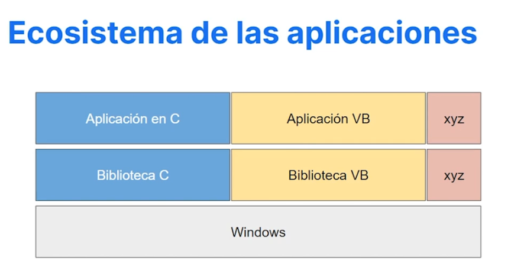

# Historia y ecosistema .NET

- Conociendo el ecosistema
- Componentes por lenguaje: 
    - Aplicación.
    - Biblioteca.
    - Plataforma.
- La maquina virtual como solución.

---
## Ecosistema de las apliaciones (Tradicional)

